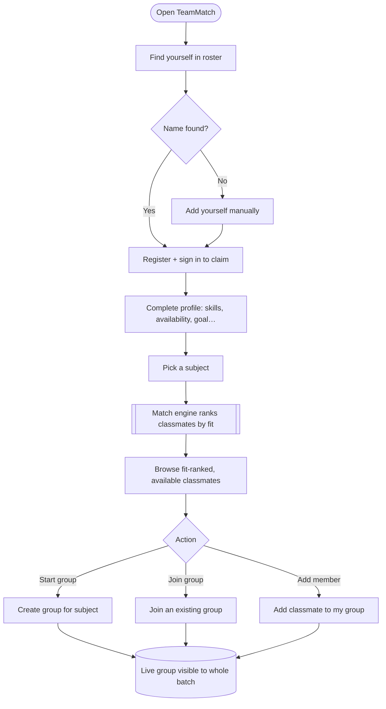
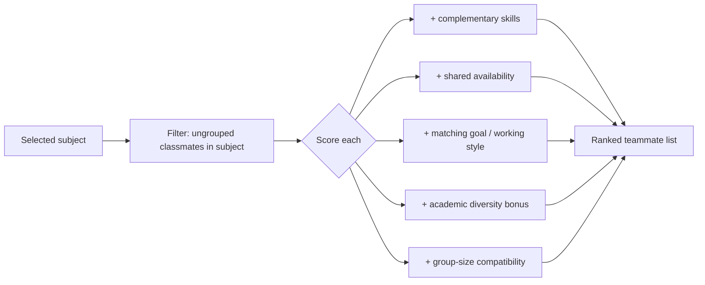
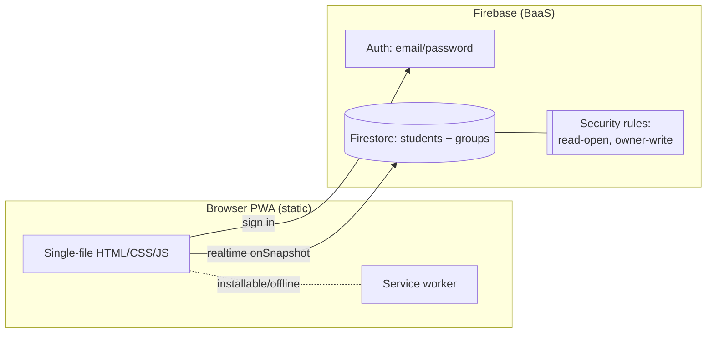
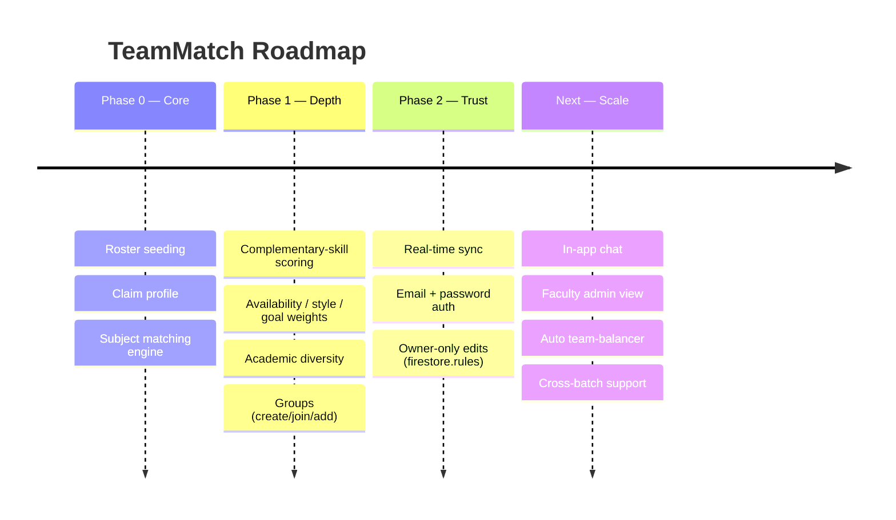
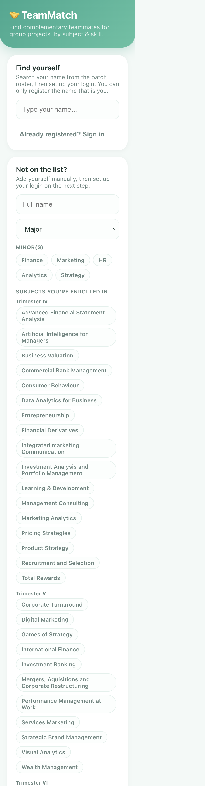

# TeamMatch — Product Requirements Document & Case Study

> **Find the *right* teammates, not the nearest ones.** A PWA that matches MBA classmates for group projects by subject, complementary skills, availability, working style and goals.

| | |
|---|---|
| **Live app** | https://aastha381.github.io/TeamMatch/ |
| **Repository** | https://github.com/AASTHA381/TeamMatch |
| **Author** | Aastha Saini |
| **Status** | Shipped & used by a live MBA batch (~146 students seeded) |
| **Type** | 0→1 consumer/edu marketplace (two-sided matching) |
| **Doc version** | 1.0 |

---

## 1. TL;DR (Loom-style walkthrough script)

> *This is TeamMatch. Every trimester, MBA group projects get formed the same lazy way — you team up with whoever's sitting next to you. The result is five strategy people and no one who can build a model, or teams where everyone's strong at the same thing.*
>
> *TeamMatch fixes team formation. You claim your name from the batch roster, fill a quick profile once — your skills, academic background, availability, working style and goals — and then for any subject across three trimesters, it ranks classmates by **fit**: who complements your skills, shares your availability, matches your goal, and adds academic diversity. You can see which teams already exist, join one, or start your own.*
>
> *It's real-time, so everyone sees groups fill up live. It's privacy-first — only name, major and subjects are pre-loaded; everything else is self-reported, and you sign in so no one can edit your profile but you. It turned a chaotic WhatsApp scramble into a structured, fair way to build balanced teams.*

**Elevator pitch:** *Tinder-style matching for balanced project teams.*

---

## 2. Problem Statement

Group projects are a core part of the MBA experience, yet **team formation is unstructured and suboptimal**. Teams form by proximity and friendship, not by complementary skill — producing unbalanced teams, duplicated strengths, and stress.

**The core problem:**
> Students have no visibility into *who complements them* for a given subject, and no fair, structured way to form balanced teams — so teams are chosen by convenience, not fit.

**Signals & evidence:**
- Repeated batch experience: last-minute WhatsApp scrambles, "does anyone need one more?", skill-imbalanced teams.
- No shared view of who's still looking vs already grouped.
- Cross-trimester electives mean your ideal teammate isn't always someone you know.

**Problem hypothesis:**
> If students can see fit-ranked, available classmates per subject and form visible teams, they'll build more balanced teams with less stress — and adopt the tool batch-wide because it's fairer for everyone.

---

## 3. Research

### 3.1 Method
- **Insider empathy** — built by a member of the batch experiencing the pain first-hand.
- **Roster analysis** — real division lists across Trimester IV/V/VI subjects (~146 students).
- **Informal validation** — feedback from classmates during rollout.

### 3.2 Key insights
| # | Insight | Product implication |
|---|---------|---------------------|
| 1 | Teams over-index on similar skills. | Rank by **complementary** skills, not similarity. |
| 2 | "Fit" is per-subject, not global. | Matching is **scoped to a chosen subject**. |
| 3 | No one knows who's still available. | Show **grouped vs ungrouped** status live. |
| 4 | Sharing SAP IDs/emails felt invasive. | Only **name/major/subjects** pre-seeded; rest self-reported. |
| 5 | People edit/claim the wrong profiles. | **Auth + ownership**: only you can edit your profile. |
| 6 | Batch tools die without instant updates. | **Real-time sync** so groups fill live. |

### 3.3 Competitive landscape
| Alternative | Reality | Gap TeamMatch fills |
|---|---|---|
| WhatsApp groups | Noisy, no structure, no fit | Structured, fit-ranked matching |
| Spreadsheets | Manual, stale, no matching logic | Live, ranked, self-updating |
| "Just ask friends" | Biased to proximity | Objective complementary-skill scoring |

---

## 4. User Personas

### Primary — "Balanced-team Bhavya" 🎯
| Attribute | Detail |
|---|---|
| Who | MBA student, mid-batch, wants a strong project grade |
| Pain | Keeps ending up in skill-imbalanced teams |
| Goal | Find teammates who cover her gaps (e.g. she's marketing, needs a numbers person) |
| Wins | Fit-ranked list per subject; forms a balanced team fast |

### Secondary — "New-to-batch Nikhil" 🧭
| Attribute | Detail |
|---|---|
| Who | Knows few classmates, especially across electives |
| Pain | No network to team up across trimesters |
| Wins | Discovers compatible strangers he'd never have found |

### Anti-persona
Students who only ever want to team with their existing friend group — low need for matching.

---

## 5. Goals & Success Metrics

### North Star Metric
> **Balanced teams formed via TeamMatch** — groups created/joined through the app for a subject.

### Supporting metrics (proposed)
| Category | Metric | Target |
|---|---|---|
| Activation | % of batch who claim a profile | ≥ 50% |
| Completeness | % profiles with skills + availability filled | ≥ 70% |
| Core value | Groups formed per subject | Trending up |
| Engagement | Match searches per active user | ≥ 3 |
| Fairness | % students who found ≥1 group | ≥ 80% |
| Trust | Zero unauthorized profile edits | 100% (enforced) |

### Guardrails
- No PII beyond self-reported fields; server-enforced ownership; real-time latency < 1s.

---

## 6. Solution & MVP Scope

**Solution:** A no-friction PWA where each student claims a roster profile, self-reports strengths, and gets subject-scoped, fit-ranked teammate suggestions plus live group formation.

### MVP (shipped)
| Capability | Description |
|---|---|
| 🪪 **Claim your profile** | Search your name from the pre-seeded batch roster |
| 🧩 **Self-reported profile** | Skills (+custom), academic background, experience, availability, working style, team role, goal, group size |
| 🎯 **Subject-based matching** | Ranked classmates by complementary skills + shared availability + goal/style match + academic diversity |
| 👥 **Groups** | See, join, create, or add to groups (with capacity) |
| 🔄 **Live sync** | Real-time Firestore listeners; changes appear instantly |
| 🔐 **Auth + ownership** | Email/password sign-in; only you can edit your profile (server-enforced) |
| 📲 **Installable PWA** | Add to home screen |

### Out of scope (MVP)
- Chat/messaging, faculty admin panel, cross-batch support, automatic optimal team assignment.

---

## 7. User Flow (Flowchart)



### Matching logic (scoring)


---

## 8. System Architecture



**Key design decisions**
- **No backend server** — Firebase (BaaS) handles auth + real-time DB, so it runs free on GitHub Pages and needs no server to maintain.
- **Ownership enforced in `firestore.rules`** (server-side), not just the client — a profile can only be edited by the account that claimed it.
- **Privacy-minimised seeding** — only name/major/subjects pre-loaded; raw roster spreadsheets are gitignored.

---

## 9. Wireframe (low-fidelity)

```
┌───────────────────────────────┐
│  🤝 TeamMatch                  │
│  Find complementary teammates  │
├───────────────────────────────┤
│  Find yourself                 │
│  [ type your name…        ]    │  ← claim from roster
│  Already registered? Sign in   │
├───────────────────────────────┤
│  Pick a subject ▾              │
│  ── Ranked teammates ──        │
│  • Priya  · complements you 92%│  ← fit score
│  • Rahul  · complements you 85%│
│  ── Groups for this subject ── │
│  [ + Start a group ]  [ Join ] │
└───────────────────────────────┘
```

Shipped UI in **Section 11**.

---

## 10. Roadmap



| Phase | Theme | Status |
|---|---|---|
| 0 | Core matching | ✅ Shipped |
| 1 | Rich scoring + groups | ✅ Shipped |
| 2 | Auth, ownership, live sync | ✅ Shipped |
| Next | Chat, admin, auto-balancer | 🔜 Planned |

---

## 11. Screenshots

### Find yourself / claim & register


*(Matching, profile and group screens appear after sign-in; roster data is limited to name / major / subjects by design.)*

---

## 12. Key Decisions & Trade-offs (PM judgement)

| Decision | Options | Choice & why |
|---|---|---|
| **Backend** | Custom server vs BaaS | **Firebase** — free, real-time, no server ops; fits GitHub Pages. |
| **Auth journey** | Google → Microsoft → email-link → **email/password** | Landed on email/password after NMIMS Azure blocked app registration — reliable for everyone. |
| **Identity** | SAP ID vs name-claim | **Name-claim + ownership lock** — no sensitive PII, still prevents impersonation. |
| **Matching** | Similarity vs complementarity | **Complementary** scoring — the whole point is balanced teams. |
| **Privacy** | Seed everything vs minimum | **Minimum seed** (name/major/subjects); rest self-reported; rosters gitignored. |

---

## 13. What I'd do next (prioritised)

1. **In-app chat / "request to join"** — close the loop after a match. *(activation)*
2. **Faculty admin view** — see coverage, nudge un-grouped students. *(fairness)*
3. **Auto team-balancer** — one-click suggested balanced teams for a subject. *(magic moment)*
4. **Cross-batch / multi-college** — generalise beyond one roster. *(scale)*

---

## 14. Appendix — Tech at a glance
- **Frontend:** single-file vanilla JS PWA, no build step.
- **Backend:** Firebase Auth (email/password) + Cloud Firestore (real-time), `firestore.rules` for owner-write.
- **Hosting:** GitHub Pages (static).
- **Privacy:** minimal seeded PII; server-enforced ownership; rosters never committed.
